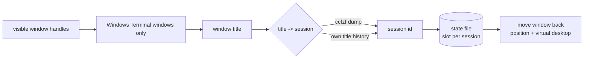

Rules based manager of windows state for Windows 11: position, desktop, pin.

## Attention
Project is dirty and will not work out of the box.

## Features:
- Place windows by config rules
- Find window by title/path regex
- Use PowerToys FancyZones layouts
- Actions: x, y, width, height, fancyZones monitor/position, pin
- Autoplace new windows after open
- Store/restore opened windows
- Set wallpapers by virtual desktop
- Opened windows stats
- Remember and restore window position per Claude Code session (claude-wt)
- Command line: place, store, restore, stats, claude-wt

Based on [MScholtes/VirtualDesktop CLI tool](https://github.com/MScholtes/VirtualDesktop).

I use it with:

- [windows-mqtt](https://github.com/popstas/windows-mqtt)
- Autohotkey


## Install
- Copy [config.example.js](config.example.js) to config.js
- See [examples](examples)

## Claude Windows Terminals sessions restore

Remembers where the Windows Terminal window of each Claude Code session sat, puts it
back when you re-enter that session, and brings the whole layout back after a crash.
Lives in `src/claude-wt/`.

### Scheme

A daemon ticks once a second and never spawns anything in that loop:



1. Poll window handles — `EnumWindows` only, no per-window process lookup. A handle is
   resolved to a process exactly once in its lifetime, so a steady tick costs ~1 ms.
   The full `getWindows()` sweep costs ~21 ms and is never called in the loop.
2. Read the title of terminal windows only. Claude Code sets the terminal title to the
   session summary and prefixes it with a status glyph (`✳ ccfzf`) while it is working;
   the glyph is stripped before any comparison.
3. Resolve title → session id: first from the ccfzf dump, then from the module's own
   history of titles it has seen. A title claimed by two windows or two equally good
   sessions is refused rather than guessed.
4. Store a slot per session id — title history, cwd, bounds, virtual desktop number —
   in `claudeWt.statePath`, written atomically.
5. When a window's title settles on a known session, put the window back at the
   remembered rectangle and virtual desktop.

The virtual desktop number is read only at the moment a window is bound to a session:
that call spawns `VirtualDesktop11.exe`, and periodic exe spawns are exactly what this
project spent effort removing.

### What depends on ccfzf

[ccfzf](https://github.com/popstas/ccfzf) is a session picker for Claude Code. Two
distinct dependencies, with different consequences if missing:

- **The session dump** (`claudeWt.sessionsFile`, e.g. `~/.ccfzf.sessions.json`, seen
  from Windows as `V:\.ccfzf.sessions.json`) maps a window title to a session id, cwd
  and liveness for the 200 newest sessions. Without it the module falls back to its own
  title history, so it still recognises sessions it has already seen — but nothing else,
  and never on a fresh state file. The dump is re-read only when its mtime changes.
- **`ccfzf --session <id>`** enters a session non-interactively. Crash restore is built
  on it: `claudeWt.launch.args` is the command line used to bring a session back, and in
  the author's setup it runs `ssh` to a Linux host and calls `ccfzf --session {id}
  --kiosk`. Without that flag restore does not work; position memory still does.

Both are configurable — the launch command is entirely in the config, so a different
picker or a local (non-ssh) setup only changes `claudeWt.launch`.

### Restore

Restore relaunches the remembered sessions one at a time, waits for each window to
appear and places it. It refuses to run while any session from the plan is still on
screen — restoring a session whose window is right there would give you a second window
onto the same transcript.

```bash
node src claude-wt watch                        # start the daemon
node src claude-wt status                       # remembered slots as JSON
node src claude-wt restore                      # bring back the last layout
node src claude-wt restore --force              # only the sessions that are missing
node src claude-wt restore --session <id> <id>  # specific sessions
node src claude-wt clear                        # forget everything
```

The same restore is reachable from `src/lib` (`restoreClaudeSessions()`), over HTTP
(`POST /claude-wt/restore` with `{force, sessionIds}`), over WebSocket (command
`claude-wt-restore`), and from the tray.

### Config

See the `claudeWt` block in [config.example.cjs](config.example.cjs). `statePath` is
required — the daemon refuses to start without it. Crash restore is manual by default:
on start the daemon reports that sessions were open before the reboot but launches
nothing unless `claudeWt.restore.auto` is set, because bringing up a handful of ssh
sessions on boot is too visible to do silently.

### Known limits

- Position is bound to a session, not a project: a new session in the same project is
  remembered separately.
- Sessions older than the 200 newest fall out of the ccfzf dump and are only recognised
  by titles the module has already seen.
- `lastLayout` holds the last tick that had windows, so sessions closed one by one while
  the daemon is alive drop out of it. Use `--session <id>` to bring those back.

## Tauri tray app

The **tauri-app** subfolder contains a system tray application that wraps the CLI. It lets you place windows and run the autoplacer without using the terminal.

### What it does
- **Tray menu**: Place Windows, Start/Stop Autoplacer, Start/Stop claude-wt, Restore claude sessions, Settings, Quit
- **Place Windows**: Runs `node src place` in the configured project directory
- **Autoplacer**: Starts or stops `node examples/autoplace-server.js` to automatically place new windows
- **claude-wt**: Starts or stops `node src/index.js claude-wt watch`; "Restore claude sessions" runs `claude-wt restore` (see [Claude Windows Terminals sessions restore](#claude-windows-terminals-sessions-restore))
- **Global hotkey**: Ctrl+Alt+Shift+P triggers "Place Windows"
- **Settings**: Project path, autoplacer interval, run on startup, notifications

### Requirements
- Rust toolchain and C++ build tools (Visual Studio "C++ build tools" workload on Windows)
- Node.js and the main project configured (see [Install](#install))

### Run
```bash
cd tauri-app
npm install
npm run tauri dev
```
